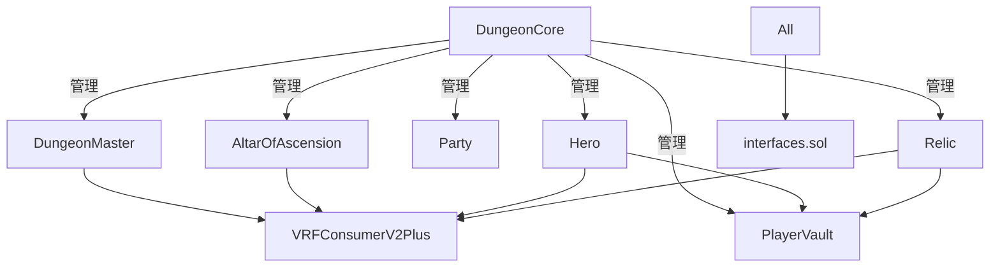

# DungeonDelvers 合約結構分析報告

## 📋 總覽

**分析日期**: 2025-08-16  
**分析範圍**: `/contracts/current/` 目錄下所有智能合約  
**總合約數**: 14 個主要合約檔案

## 📊 合約統計

| 類別 | 合約名稱 | 行數 | 主要功能 |
|------|----------|------|----------|
| **核心** | DungeonCore.sol | 152 | 系統總控制器 |
| **核心** | DungeonMaster.sol | 336 | 地城探索邏輯 |
| **核心** | DungeonStorage.sol | 97 | 地城數據存儲 |
| **核心** | AltarOfAscension.sol | 515 | 升星祭壇 |
| **核心** | VRFConsumerV2Plus.sol | 489 | VRF 隨機數管理 |
| **DeFi** | Oracle.sol | 339 | 價格預言機 |
| **DeFi** | PlayerVault.sol | 341 | 玩家金庫 |
| **DeFi** | SoulShard.sol | 201 | 遊戲代幣 |
| **NFT** | Hero.sol | 363 | 英雄 NFT |
| **NFT** | Relic.sol | 366 | 聖物 NFT |
| **NFT** | Party.sol | 224 | 隊伍 NFT |
| **NFT** | VIPStaking.sol | 216 | VIP 質押 |
| **NFT** | PlayerProfile.sol | 155 | 玩家檔案 |
| **接口** | interfaces.sol | 411 | 統一接口定義 |

**總代碼行數**: 4,205 行

## 🔗 依賴關係分析

### 核心依賴模式


### 接口統一性 ✅
- 所有合約都依賴統一的 `interfaces.sol`
- VRF 回調接口標準化
- 無循環依賴

## 🔄 重複代碼分析

### 1. **管理函數模式重複**
以下函數在多個合約中重複出現：

| 函數類型 | 出現次數 | 合約清單 |
|----------|----------|----------|
| `pause()/unpause()` | 7 | Hero, Relic, DungeonMaster, AltarOfAscension, PlayerVault, Party, VIPStaking |
| `withdrawNative()` | 5 | Hero, Relic, Party, PlayerVault, AltarOfAscension |
| `setPlatformFee()` | 4 | Hero, Relic, Party, DungeonMaster |
| `receive() payable` | 5 | Hero, Relic, Party, AltarOfAscension, VRFConsumerV2Plus |

**建議**: 考慮創建 `AdminBase` 合約包含通用管理函數。

### 2. **VRF 回調模式重複**
```solidity
// 在 4 個合約中重複的模式
function onVRFFulfilled(uint256 requestId, uint256[] memory randomWords) external override {
    if (msg.sender != vrfManager) return;
    if (randomWords.length == 0) return;
    // ... 處理邏輯
}
```

**合約**: Hero, Relic, DungeonMaster, AltarOfAscension  
**狀態**: ✅ 已標準化，一致性良好

### 3. **相似的鑄造邏輯**
Hero 和 Relic 的鑄造函數模式幾乎相同：
- `mintFromWallet()`
- `mintFromVault()`
- VRF 回調處理

**差異僅在**:
- Hero: `uint256 power` (15-255 範圍)
- Relic: `uint8 capacity` (1-5 範圍)

## 🗑️ 死代碼識別

### 1. **commitReveal 目錄** ❌
**位置**: `/contracts/current/commitReveal/`  
**內容**: 15 個 Markdown 文檔，無 .sol 檔案  
**狀態**: 全為文檔，非代碼死區

### 2. **未使用的接口方法**
在 `interfaces.sol` 中發現以下可能未使用的接口：
```solidity
// 這些在 current 目錄中可能未被實現
function revealExpedition() external;
function revealExpeditionFor(address user) external;
```

### 3. **版本遺留檔案** ✅
**好消息**: `/contracts/current/` 目錄內無版本遺留檔案  
**乾淨度**: 所有檔案都是當前使用版本

## ⚠️ 潛在衝突問題

### 1. **多重 VRF Manager 設置**
4 個合約都有獨立的 `setVRFManager()` 函數：
```solidity
// 在 Hero, Relic, DungeonMaster, AltarOfAscension 中重複
function setVRFManager(address _vrfManager) external onlyOwner
```

**風險**: 可能導致 VRF Manager 地址不一致  
**建議**: 集中在 DungeonCore 管理

### 2. **平台費設置分散**
平台費在多個合約中獨立管理：
- Hero: `platformFee = 0.0003 ether`
- Relic: `platformFee = 0.0003 ether`  
- Party: `platformFee = 0.0003 ether`
- DungeonMaster: `platformFee = 0.001 ether`

**風險**: 費用不一致  
**建議**: 統一由 DungeonCore 管理

### 3. **重複的 Pausable 邏輯**
7 個合約都實現了獨立的暫停機制：

**風險**: 需要逐一暫停每個合約  
**建議**: 集中暫停控制

## 🔧 冗餘優化建議

### 高優先級優化

1. **創建 BaseContract 抽象合約**
```solidity
abstract contract BaseContract is Ownable, Pausable, ReentrancyGuard {
    function emergencyPause() external onlyOwner;
    function withdrawNative() external onlyOwner;
    receive() external payable {}
}
```

2. **VRF Manager 集中管理**
```solidity
// 在 DungeonCore 中統一管理
function setGlobalVRFManager(address _vrfManager) external onlyOwner {
    // 更新所有合約的 VRF Manager
}
```

3. **平台費統一管理**
```solidity
// 在 DungeonCore 中集中設置
mapping(string => uint256) public platformFees;
// "mint" => 0.0003 ether
// "expedition" => 0.001 ether
```

### 中優先級優化

4. **接口清理**
- 移除未使用的 `revealExpedition*` 接口
- 整合相似的查詢接口

5. **事件標準化**
- 統一事件命名規範
- 添加統一的系統級事件

## 📈 代碼品質評分

| 維度 | 評分 | 說明 |
|------|------|------|
| **架構設計** | 8/10 | 清晰的分層架構，合理的責任分離 |
| **代碼重用** | 6/10 | 存在重複，但模式一致 |
| **接口一致性** | 9/10 | 統一的接口設計，VRF 標準化良好 |
| **安全性** | 8/10 | 良好的修飾符和檢查機制 |
| **可維護性** | 7/10 | 結構清晰，但重複代碼影響維護 |

## ✅ 正面特徵

1. **統一的 VRF 整合**: 所有隨機數需求已標準化
2. **無版本遺留**: current 目錄非常乾淨
3. **一致的安全模式**: ReentrancyGuard, Pausable 廣泛使用
4. **清晰的接口分離**: interfaces.sol 統一管理
5. **模組化設計**: 功能分離良好

## 🎯 建議行動清單

### 立即可做 (Low Risk)
- [ ] 移除 commitReveal 目錄（僅文檔）
- [ ] 清理未使用的接口方法
- [ ] 統一註釋風格

### 計劃重構 (Medium Risk)  
- [ ] 創建 BaseContract 抽象合約
- [ ] VRF Manager 集中管理
- [ ] 平台費統一設置

### 長期優化 (High Impact)
- [ ] 實現全局暫停機制
- [ ] 合約升級策略設計
- [ ] Gas 優化重構

---

**總結**: DungeonDelvers 合約系統整體架構良好，主要問題集中在重複代碼和管理函數分散。通過適當的重構可以顯著提升可維護性。