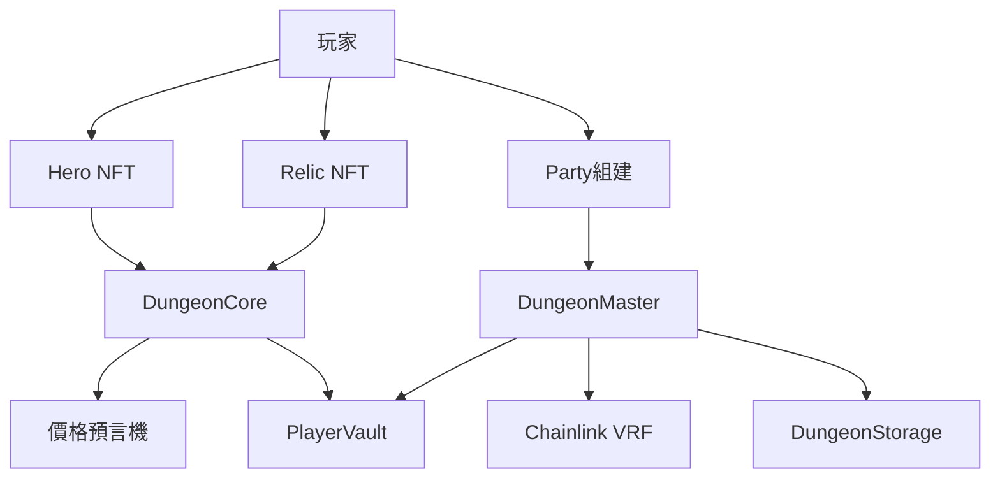

# 🏰 DungeonDelvers 技術規格文檔 V1.4.0.3

## 📋 執行摘要

DungeonDelvers（Soulbound Saga）是一款運行在 BSC 主網上的去中心化 NFT 地下城探險遊戲。玩家通過鑄造英雄NFT、收集神器、組建探險隊伍，探索不同難度的地下城並獲得 $SOUL 代幣獎勵。

### 核心特性
- **完全鏈上遊戲邏輯**：所有遊戲機制均由智能合約執行
- **Chainlink VRF 隨機性**：確保公平的隨機數生成
- **模組化合約架構**：支援升級和擴展
- **多層級經濟系統**：USD/SOUL 雙幣機制
- **VIP 質押系統**：提供遊戲增益和收益分享

## 🏗️ 系統架構

### 1. 合約層級結構

```
DungeonCore (中央控制器)
    ├── Core Contracts
    │   ├── DungeonMaster (探險管理)
    │   ├── DungeonStorage (狀態存儲)
    │   ├── VRFConsumerV2Plus (隨機數)
    │   └── AltarOfAscension (升級系統)
    │
    ├── NFT Contracts
    │   ├── Hero (英雄NFT)
    │   ├── Relic (神器NFT)
    │   ├── Party (隊伍NFT)
    │   ├── PlayerProfile (玩家檔案)
    │   └── VIPStaking (VIP質押)
    │
    └── DeFi Contracts
        ├── Oracle (價格預言機)
        ├── PlayerVault (玩家金庫)
        ├── TUSD1 (USD穩定幣)
        └── TSOUL (遊戲代幣)
```

### 2. 關鍵合約間交互



## 💎 NFT 系統規格

### Hero NFT (英雄)

**合約地址模式**: `Hero.sol`

**核心屬性**:
- `rarity`: uint8 (1-5級稀有度)
- `power`: uint16 (戰力值)

**稀有度分佈**:
| 稀有度 | 等級 | 戰力範圍 | 出現概率 |
|--------|------|----------|----------|
| N (Normal) | 1 | 10-25 | 40% |
| R (Rare) | 2 | 26-50 | 30% |
| SR (Super Rare) | 3 | 51-100 | 20% |
| SSR | 4 | 101-200 | 8% |
| UR (Ultra Rare) | 5 | 201-300 | 2% |

**鑄造機制**:
- 價格: 2 USD等值的 $SOUL
- 平台費: 0.0003 BNB/英雄
- 批量鑄造: 最多50個/交易
- VRF回調: 異步賦予屬性

### Relic NFT (神器)

**合約地址模式**: `Relic.sol`

**核心屬性**:
- `rarity`: uint8 (1-5級稀有度)
- `capacity`: uint8 (容納英雄數量)

**容量系統**:
| 稀有度 | 容量範圍 |
|--------|----------|
| N | 1-2 |
| R | 2-3 |
| SR | 3-4 |
| SSR | 4-5 |
| UR | 5 |

### Party NFT (隊伍)

**組建規則**:
- 神器數量: 1-5個
- 英雄數量: 最多25個（受神器總容量限制）
- 平台費: 0.001 BNB
- 總戰力 = Σ(英雄戰力)

## ⚔️ 遊戲機制

### 地下城系統

**12個地下城配置**:

| ID | 名稱 | 需求戰力 | 獎勵(USD) | 基礎成功率 |
|----|------|----------|-----------|------------|
| 0 | 新手礦洞 | 10 | $6 | 95% |
| 1 | 哥布林洞穴 | 25 | $12 | 90% |
| 2 | 食人魔山谷 | 50 | $20 | 85% |
| 3 | 蜘蛛巢穴 | 100 | $33 | 80% |
| 4 | 石化蜥蜴沼澤 | 200 | $52 | 75% |
| 5 | 巫妖墓穴 | 400 | $78 | 70% |
| 6 | 奇美拉之巢 | 800 | $113 | 65% |
| 7 | 惡魔前哨站 | 1600 | $156 | 60% |
| 8 | 巨龍之巔 | 3200 | $209 | 55% |
| 9 | 混沌深淵 | 4800 | $225 | 50% |
| 10 | 熔岩地獄 | 6400 | $280 | 45% |
| 11 | 虛空裂隙 | 8000 | $400 | 40% |

### 探險機制

1. **請求階段**:
   - 檢查隊伍戰力 >= 地下城需求
   - 支付探險費: 0.0015 BNB
   - 設置24小時冷卻時間
   - 請求 Chainlink VRF 隨機數

2. **結算階段**:
   - VRF 回調提供隨機數
   - 計算成功率 = 基礎成功率 + VIP加成 + 戰力加成
   - 成功: 發放 USD等值 $SOUL 獎勵
   - 失敗: 僅獲得經驗值

3. **獎勵計算**:
```solidity
實際獎勵 = 地下城獎勵 * globalRewardMultiplier / 1000
$SOUL數量 = Oracle.getAmountOut(USD, 實際獎勵)
```

## 💰 經濟系統

### 代幣機制

**$SOUL (遊戲代幣)**:
- 標準: ERC-20
- 精度: 18 decimals
- 用途: 遊戲內鑄造、升級、獎勵
- 鑄造權: PlayerVault合約

**USD1 (穩定幣)**:
- 標準: ERC-20
- 精度: 18 decimals
- 錨定: 1 USD
- 用途: 價值計算基準

### 價格預言機

**Oracle合約功能**:
- Uniswap V3 TWAP (時間加權平均價格)
- 30分鐘觀察窗口
- 自動價格更新機制

### VIP 質押系統

**等級劃分**:
| 等級 | 質押量(SOUL) | 探險成功率加成 | 獎勵加成 |
|------|--------------|----------------|----------|
| VIP 0 | 0 | 0% | 0% |
| VIP 1 | 100 | +2% | +5% |
| VIP 2 | 500 | +4% | +10% |
| VIP 3 | 1,000 | +6% | +15% |
| VIP 4 | 5,000 | +8% | +20% |
| VIP 5 | 10,000 | +10% | +25% |

**Soulbound特性**:
- 實現 EIP-5192 標準
- NFT 不可轉移
- 24小時解質押冷卻期

## 🔐 安全機制

### 訪問控制
- **Ownable**: 管理員權限
- **ReentrancyGuard**: 防重入攻擊
- **Pausable**: 緊急暫停機制

### 關鍵安全特性

1. **跨合約調用驗證**:
```solidity
require(msg.sender == dungeonCore.heroContractAddress(), "Unauthorized");
```

2. **VRF 請求追蹤**:
```solidity
mapping(uint256 => address) public requestIdToUser;
mapping(address => MintRequest) public userRequests;
```

3. **資金管理**:
- SafeERC20 用於代幣操作
- 嚴格的餘額檢查
- 防止整數溢出 (Solidity 0.8.20+)

### 緊急機制

**緊急重置功能**:
- 清理掛起的請求
- 退還用戶資金
- 僅管理員可執行

## 🚀 Gas 優化策略

### Storage 優化
```solidity
struct HeroData {
    uint8 rarity;   // 1 byte
    uint16 power;   // 2 bytes
} // 打包到單個 storage slot
```

### 批量操作
- 批量鑄造: 減少交易次數
- 批量賦值: 優化 VRF 回調

### 查詢優化
- 使用 view 函數減少 gas 消耗
- 緩存常用數據在 memory

## 📊 監控與事件

### 關鍵事件

**遊戲事件**:
- `HeroMinted`: 英雄鑄造
- `RelicMinted`: 神器鑄造
- `PartyCreated`: 隊伍組建
- `ExpeditionFulfilled`: 探險結果

**系統事件**:
- `VRFRequestFulfilled`: 隨機數生成
- `PartyCooldownUpdated`: 冷卻更新
- `VipLevelChanged`: VIP等級變更

### Subgraph 索引
- 實時追蹤遊戲狀態
- 玩家數據聚合
- 經濟指標監控

## 🔧 部署配置

### 網絡配置
- **主網**: BSC Mainnet (Chain ID: 56)
- **測試網**: BSC Testnet (Chain ID: 97)
- **Gas Price**: 0.11 gwei (固定)

### 依賴項
```json
{
  "@openzeppelin/contracts": "^5.0.0",
  "@chainlink/contracts": "^1.2.0",
  "hardhat": "^2.22.12",
  "foundry": "^0.2.0"
}
```

### 初始化參數
```javascript
// DungeonCore 構造函數
constructor(
    address _initialOwner,
    address _usdToken,      // USD1 合約
    address _soulShardToken // TSOUL 合約
)

// VRF 配置
subscriptionId: 環境變量
keyHash: 0x...
callbackGasLimit: 2,500,000
requestConfirmations: 3
numWords: 動態計算
```

## 📈 性能指標

### 交易成本估算
| 操作 | Gas 使用量 | BNB 成本 (@3 gwei) |
|------|-----------|-------------------|
| 鑄造英雄 | ~250,000 | ~0.00075 BNB |
| 組建隊伍 | ~400,000 | ~0.0012 BNB |
| 探險請求 | ~180,000 | ~0.00054 BNB |
| VIP質押 | ~120,000 | ~0.00036 BNB |

### 吞吐量
- 最大並發請求: 受 VRF 訂閱限制
- 每區塊交易數: ~100-150
- 冷卻期: 24小時/隊伍

## 🔄 升級路徑

### V1.4.0.3 改進
- EIP-4906 元數據刷新支持
- EIP-5192 Soulbound Token 標準
- VRF 訂閱模式優化
- Gas 效率提升 ~20%

### 未來規劃
- Layer 2 擴容方案
- 跨鏈橋接
- DAO 治理機制
- 動態 NFT 屬性

## 📝 合規性

### 標準實現
- **ERC-721**: NFT 標準
- **ERC-20**: 代幣標準
- **ERC-165**: 接口檢測
- **EIP-4906**: 元數據更新
- **EIP-5192**: Soulbound Token

### 審計狀態
- 內部測試: ✅ 完成
- 代碼審查: ✅ 完成
- 外部審計: 🔄 進行中

## ⚠️ 風險警告

### 已知限制
1. VRF 請求可能延遲 (網絡擁堵)
2. Oracle 價格延遲 (30分鐘 TWAP)
3. 單用戶並發請求限制
4. 24小時冷卻期不可更改

### 緩解措施
- 緊急暫停機制
- 管理員干預功能
- 用戶資金保護
- 事件監控系統

---

**版本**: 1.4.0.3
**更新日期**: 2025-09-26
**狀態**: 內部測試版
**聯繫**: technical@dungeondelvers.com